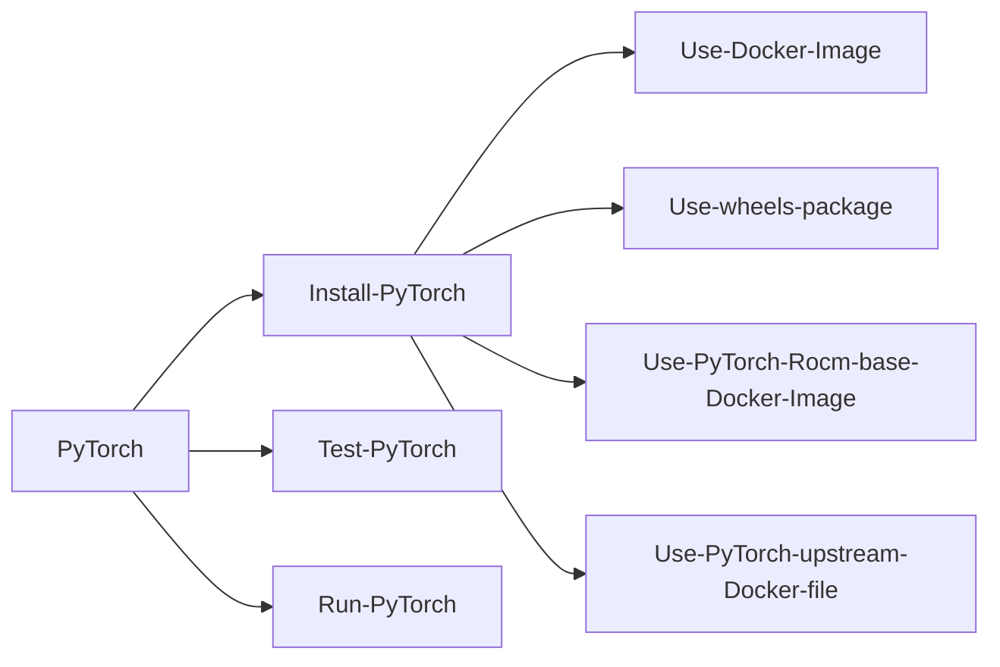
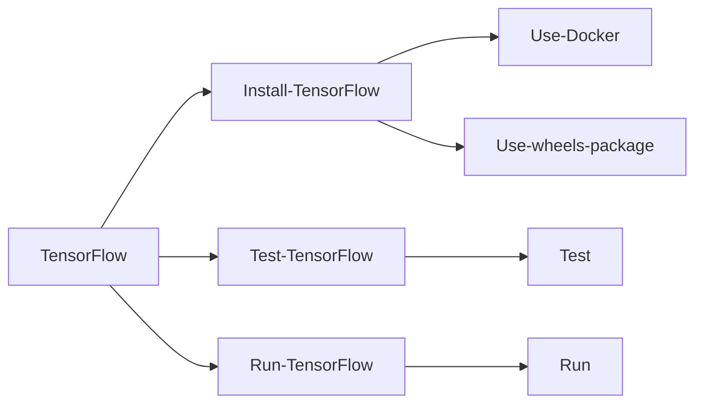
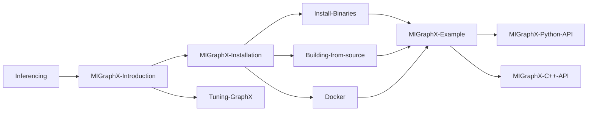

[AMD Official Use Only]

<table width="100%" align="center">
 <tr width="100%" align="center">
    <td align="center"><h1>Deep Learning Guide </h1>
 </tr>
</table>

<table>
 <tr>
  <td> Publication: 1.0    Revision: 0607 </td>
 </tr>
 <tr>
  <td> Issue Date: June 2022 </td>
 </tr>
 </table>
 
 © 2021-22 Advanced Micro Devices, Inc. All Rights Reserved.


# Table of Contents

<table1>
<tr>
<td>
<pre>
<a href="https://github.com/anubhavamd/Deep-Learning-Updated/edit/main/README.md#chapter-1-introduction-to-machine-learning-and-deep-learning">Chapter 1 Introduction to Machine Learning and Deep Learning </a>
         <a href="https://github.com/anubhavamd/Deep-Learning-Updated/edit/main/README.md#11-machine-learning">1.1 Machine Learning </a>
         <a href="https://github.com/anubhavamd/Deep-Learning-Updated/edit/main/README.md#12-deep-learning">1.2 Deep Learning </a>
         <a href="https://github.com/anubhavamd/Deep-Learning-Updated/edit/main/README.md#13-amd-contribution-to-machine-learning-and-deep-learning">1.3 AMD Contribution to Machine Learning and Deep Learning </a>
<a href="https://github.com/anubhavamd/Deep-Learning-Updated/edit/main/README.md#chapter-2-prerequisites">Chapter 2 Prerequisites </a>
         <a href="https://github.com/anubhavamd/Deep-Learning-Updated/edit/main/README.md#21-hardware-prerequisites">2.1 Hardware Prerequisites </a>
         <a href="https://github.com/anubhavamd/Deep-Learning-Updated/edit/main/README.md#22-rocm-installation-guide">2.2 ROCm Installation Guide </a>
                  <a href="https://github.com/anubhavamd/Deep-Learning-Updated/edit/main/README.md#221-rocm-user-space-and-kernel-driver-compatibility">2.2.1 ROCm User-space and Kernel Driver Compatibility </a>
                  <a href="https://github.com/anubhavamd/Deep-Learning-Updated/edit/main/README.md#222-rocm-framework-compatibility">2.2.2 ROCm Framework Compatibility </a>
                  <a href="https://github.com/anubhavamd/Deep-Learning-Updated/edit/main/README.md#223-installation">2.2.3 Installation </a>
                  <a href="https://github.com/anubhavamd/Deep-Learning-Updated/edit/main/README.md#224-verifying-rocm-installation">2.2.4 Verifying ROCm Installation </a>
<a href="https://github.com/anubhavamd/Deep-Learning-Updated/edit/main/README.md#chapter-3-frameworks-installation-guide">Chapter 3 Frameworks Installation Guide </a>
         <a href="https://github.com/anubhavamd/Deep-Learning-Updated/edit/main/README.md#31-pytorch">3.1 PyTorch </a>
                  <a href="https://github.com/anubhavamd/Deep-Learning-Updated/edit/main/README.md#311-installing-pytorch">3.1.1 Installing PyTorch </a>
                           <a href="https://github.com/anubhavamd/Deep-Learning-Updated/edit/main/README.md#3111-option-1-recommended-use-docker-image-with-pytorch-pre-installed">3.1.1.1 Option 1 (Recommended): Use Docker Image with PyTorch Pre-installed </a>
                           <a href="https://github.com/anubhavamd/Deep-Learning-Updated/edit/main/README.md#3112-option-2-install-pytorch-using-wheels-package">3.1.1.2 Option 2: Install PyTorch Using Wheels Package </a>
                           <a href="https://github.com/anubhavamd/Deep-Learning-Updated/edit/main/README.md#3113-option-3-install-pytorch-using-pytorch-rocm-base-docker-image">3.1.1.3 Option 3: Install PyTorch Using PyTorch ROCm Base Docker Image </a>
                           <a href="https://github.com/anubhavamd/Deep-Learning-Updated/edit/main/README.md#3114-option-4-install-using-pytorch-upstream-docker-file">3.1.1.4 Option 4: Install Using PyTorch Upstream Docker File </a>
                  <a href="https://github.com/anubhavamd/Deep-Learning-Updated/edit/main/README.md#312-test-the-pytorch-installation">3.1.2 Test the PyTorch Installation </a>
                  <a href="https://github.com/anubhavamd/Deep-Learning-Updated/edit/main/README.md#313-run-a-basic-pytorch-example">3.1.3 Run a Basic PyTorch Example </a>
         <a href="https://github.com/anubhavamd/Deep-Learning-Updated/edit/main/README.md#32-tensorflow">3.2 TensorFlow </a>
                  <a href="https://github.com/anubhavamd/Deep-Learning-Updated/edit/main/README.md#321-installing-tensorflow">3.2.1 Installing TensorFlow </a>
                           <a href="https://github.com/anubhavamd/Deep-Learning-Updated/edit/main/README.md#3211-option-1-install-tensorflow-using-docker-image">3.2.1.1 Option 1: Install TensorFlow using Docker image </a>
                           <a href="https://github.com/anubhavamd/Deep-Learning-Updated/edit/main/README.md#3212-option-2-install-tensorflow-using-wheels-package">3.2.1.2 Option 2: Install TensorFlow Using Wheels Package </a>
                  <a href="https://github.com/anubhavamd/Deep-Learning-Updated/edit/main/README.md#322-test-the-tensorflow-installation">3.2.2 Test the TensorFlow Installation </a>
                  <a href="https://github.com/anubhavamd/Deep-Learning-Updated/edit/main/README.md#323-run-a-basic-tensorflow-example">3.2.3 Run a Basic TensorFlow Example </a>
<a href="https://github.com/anubhavamd/Deep-Learning-Updated/edit/main/README.md#chapter-4-deep-learning-training">Chapter 4 Deep Learning Training </a>
                  <a href="https://github.com/anubhavamd/Deep-Learning-Updated/edit/main/README.md#411-case-studies">4.1.1 Case Studies </a>
                           <a href="https://github.com/anubhavamd/Deep-Learning-Updated/edit/main/README.md#4111-inception-v3-with-pytorch">4.1.1.1 Inception v3 with PyTorch </a>
                                    <a href="https://github.com/anubhavamd/Deep-Learning-Updated/edit/main/README.md#41111-evaluating-a-pre-trained-model">4.1.1.1.1 Evaluating a Pre-trained Model </a>
                                    <a href="https://github.com/anubhavamd/Deep-Learning-Updated/edit/main/README.md#41112-training-inception-v3">4.1.1.1.2 Training inception v3 </a>
                           <a href="https://github.com/anubhavamd/Deep-Learning-Updated/edit/main/README.md#4112-custom-model-with-cifar-10-on-pytorch">4.1.1.2 Custom Model with CIFAR-10 on PyTorch </a>
                           <a href="https://github.com/anubhavamd/Deep-Learning-Updated/edit/main/README.md#4113-case-study-tensorflow-with-fashion-mnist">4.1.1.3 Case Study: TensorFlow with Fashion MNIST </a>
                           <a href="https://github.com/anubhavamd/Deep-Learning-Updated/edit/main/README.md#4114-case-study-tensorflow-with-text-classification">4.1.1.4 Case Study: TensorFlow with Text Classification </a>
<a href="https://github.com/anubhavamd/Deep-Learning-Updated/edit/main/README.md#chapter-5-optimization">Chapter 5 Optimization </a>
         <a href="https://github.com/anubhavamd/Deep-Learning-Updated/edit/main/README.md#51-inferencing">5.1 Inferencing </a>
                  <a href="https://github.com/anubhavamd/Deep-Learning-Updated/edit/main/README.md#511-migraphx-introduction">5.1.1 MIGraphX Introduction </a>
                  <a href="https://github.com/anubhavamd/Deep-Learning-Updated/edit/main/README.md#512-migraphx-installation">5.1.2 MIGraphX Installation </a>
                           <a href="https://github.com/anubhavamd/Deep-Learning-Updated/edit/main/README.md#5121-option-1-installing-binaries">5.1.2.1 Option 1: Installing Binaries </a>
                           <a href="https://github.com/anubhavamd/Deep-Learning-Updated/edit/main/README.md#5122-option-2-building-from-source">5.1.2.2 Option 2: Building from Source </a>
                           <a href="https://github.com/anubhavamd/Deep-Learning-Updated/edit/main/README.md#5123-option-3-use-docker">5.1.2.3 Option 3: Use Docker </a>
                  <a href="https://github.com/anubhavamd/Deep-Learning-Updated/edit/main/README.md#513-migraphx-example">5.1.3 MIGraphX Example </a>
                           <a href="https://github.com/anubhavamd/Deep-Learning-Updated/edit/main/README.md#5131-migraphx-python-api">5.1.3.1 MIGraphX Python API </a>
                           <a href="https://github.com/anubhavamd/Deep-Learning-Updated/edit/main/README.md#5132-migraphx-c-api">5.1.3.2 MIGraphX C++ API </a>
                  <a href="https://github.com/anubhavamd/Deep-Learning-Updated/edit/main/README.md#514-tuning-migraphx">5.1.4 Tuning MIGraphX </a>
                           <a href="https://github.com/anubhavamd/Deep-Learning-Updated/edit/main/README.md#5141-known-issue">5.1.4.1 Known Issue </a>
<a href="https://github.com/anubhavamd/Deep-Learning-Updated/edit/main/README.md#chapter-6-troubleshooting">Chapter 6 Troubleshooting </a>
<a href="https://github.com/anubhavamd/Deep-Learning-Updated/edit/main/README.md#chapter-7-references">Chapter 7 References </a>
</tr>
</td>
</pre>
</table1>

# Chapter 1 Introduction to Machine Learning and Deep Learning

## 1.1 Machine Learning

<table width="100%" align="center">
 <tr width="100%" align="center">
    <td align="center">
 </tr>
</table>

Machine Learning (ML) is a field within Artificial Intelligence (AI) that focuses on algorithms that can learn from experience or data, and automatically improve outcomes. These algorithms can adapt to new circumstances, unlike explicitly programmed programs. These classes of algorithms detect patterns in the underlying data and modify an underlying model to extrapolate to new situations.

Within ML, this guide primarily focuses on supervised learning algorithms. The training data consists of inputs and desired outputs in the model during the &quot;training phase.&quot; The training algorithm learns the underlying model parameters through an iterative optimization process. During the evaluation phase, the model topology with the trained model parameters from the learned agent is evaluated based on its performance against new data.

## 1.2 Deep Learning

<table width="100%" align="center">
 <tr width="100%" align="center">
    <td align="center">
 </tr>
</table>

Deep Learning (DL) algorithms are a class of Machine Learning algorithms inspired by biological neural networks and comprise multiple levels of simple component layers. The earliest component classifier is the perceptron, a binary classifier comprising a linear fully connected stage with a non-linear decision stage. Modern Deep Learning component layers include widely accepted layers such as convolution, activation, fully connected, long short-term memory, or custom layers designed by application developers.

Training a DL network uses large amounts of data. DL algorithms make use of deep neural networks to access, explore, and analyze vast sets of information—such as all the music files on streaming platforms that make ongoing suggestions based on the tastes of a specific user. The primary distinguishing factor between DL and ML is the representation of data. The input—whether an image, a news article, or a song—is evaluated in its raw or untagged form with minimal transformation. This unsupervised training process is sometimes called representation learning. During training, the DL algorithm progressively learns from the data to improve the accuracy of its conclusions (also known as inference).

Common examples of Deep Learning include:

- Autonomous Driving: Combining deep data (maps, satellite traffic images, weather reports, a user&#39;s accumulated preferences), real-time sensor input from the environment (a deer in the road, a swerving driver), and compute power to make decisions (slow down, turn the steering wheel).
- Medical: Cancer research, such as learning to detect melanoma in photos.
- Smart Home: Smart speakers use intelligent personal assistants and voice-recognition algorithms to comprehend and respond to unique users&#39; verbal requests.

## 1.3 AMD Contribution to Machine Learning and Deep Learning

Machine Learning (ML) and Deep Learning (DL) intelligent applications that respond with human-like reflexes require an enormous amount of computer processing power.

The main contributions of AMD to ML and DL systems come from delivering high-performance compute (both CPUs and GPUs) with an open ecosystem for software development. ML and DL applications rely on computer hardware to support the highest processing capabilities (speed, capacity, and organization) to manage complex data sets from multiple input streams simultaneously.

For example, in an autonomous driving scenario, the DL algorithm might be required to recognize an upcoming traffic light changing from green to yellow, nearby pedestrian movement, and water on the pavement from a rainstorm—among a variety of other real-time variables, as well as basic vehicle operations. A trained human driver may take these coordinating reactions for granted. But, to simulate the human brain&#39;s capabilities, the autonomous driving algorithm needs efficient and accelerated processing to make complex decisions with sufficient speed and high accuracy for passengers and others around them.

The performance of AMD hardware and associated software also offers excellent benefits to developing and testing ML and DL systems. Today, a computing platform built with the latest AMD technologies (AMD EPYC™ CPUs and Radeon Instinct™ GPUs) can develop and test a new intelligent application in days or weeks, a process that used to take years.

# Chapter 2 Prerequisites

## 2.1 Hardware Prerequisites

Confirm that the installation hardware supports the ROCm™ stack.

[https://github.com/RadeonOpenCompute/ROCm#Hardware-and-Software-Support](https://github.com/RadeonOpenCompute/ROCm#Hardware-and-Software-Support)

## 2.2 ROCm Installation Guide

### 2.2.1 ROCm User-space and Kernel Driver Compatibility

ROCm user-space API is guaranteed to be compatible with certain older and newer ROCm base driver installations. This matrix should be considered when running a Docker container with a different version of ROCm than installed on the host.

**Note** The color in the tables may look slightly different.

**Table 1: ROCm Userspace Compatibility with KFD**

**Legends:**

**Light Green** : Supported version

**Light Blue** : Versions with backward compatibility

**Light Grey** : Unsupported version

<table width="100%" align="center">
 <tr width="100%" align="center">
    <td align="center">
 </tr>
</table>

Kernel space compatibility meets the following condition:

- Userspace works with -/+ 2 releases of kernel space.

### 2.2.2 ROCm Framework Compatibility

The ROCm release supports the most recent and two prior releases of PyTorch and TensorFlow.

**Table 2: ROCm Framework Compatibility with PyTorch**

**Legends:**

**Light Blue** : Versions with backward compatibility

**Light Grey** : Unsupported version

<table width="100%" align="center">
 <tr width="100%" align="center">
    <td align="center">
 </tr>
</table>

**Table 3: ROCm Framework Compatibility with TensorFlow**

**Legends:**

**Light Blue** : Versions with backward compatibility

**Light Grey** : Unsupported version

<table width="100%" align="center">
 <tr width="100%" align="center">
    <td align="center">
 </tr>
</table>

### 2.2.3 Installation

Refer to the latest ROCm installation guide.

### 2.2.4 Verifying ROCm Installation

You may verify the ROCm installation using the &#39;rocminfo&#39; command.

```
$ /opt/rocm-\&lt;version\&gt;/bin/rocminfo
```

# Chapter 3 Frameworks Installation Guide

## 3.1 PyTorch

<table width="100%" align="center">
 <tr width="100%" align="center">
    <td align="center">
 </tr>
</table>

PyTorch is an open-source Machine Learning Python library, primarily differentiated by Tensor computing with GPU acceleration and a type-based automatic differentiation. Other advanced features include support for distributed training, native ONNX support, C++ frontend, ability to deploy at scale using TorchServe, and production-ready deployment mechanism through TorchScript.

Below is the PyTorch framework installation flow using different approaches. Here the flow has clickable links.



### 3.1.1 Installing PyTorch

To install ROCm™ on bare-metal, follow the instructions in section [2.2 ROCm installation guide](#_ROCm_Installation_guide). The recommended option to get a PyTorch environment is through Docker. However, installing the PyTorch wheel package on bare metal is also supported.

#### 3.1.1.1 Option 1 (Recommended): Use Docker Image with PyTorch Pre-installed

Using Docker gives you portability and access to a prebuilt Docker container that has been rigorously tested within AMD. This might also save on the compilation time and should perform exactly as it did when tested, without facing potential installation issues.

Follow these steps:

1. Pull the latest public PyTorch Docker image.

```
   docker pull rocm/pytorch:latest
```

Optionally, you may download a specific and supported configuration with different user-space ROCm versions, PyTorch versions, and supported operating systems. To download PyTorch Docker image, refer to the following link:[https://hub.docker.com/r/rocm/pytorch](https://hub.docker.com/r/rocm/pytorch)

2. Start a Docker container using the downloaded image.

```
   docker run -it --cap-add=SYS\_PTRACE --security-opt 
   seccomp=unconfined --device=/dev/kfd --device=/dev/dri --group-add 
   video --ipc=host --shm-size 8G rocm/pytorch:latest
```

This will automatically download the image if it does not exist on the host. You can also pass -v argument to mount any data directories from the host onto the container.

#### 3.1.1.2 Option 2: Install PyTorch Using Wheels Package

PyTorch supports the ROCm platform by providing tested wheel packages. To access this feature, refer to [https://pytorch.org/get-started/locally/](https://pytorch.org/get-started/locally/) and choose the "ROCm” compute platform. 

<table width="100%" align="center">
 <tr width="100%" align="center">
    <td align="center"><h5>Figure 1: Installation of matrix from pytorch.org</h5>
 </tr>
</table>

To install PyTorch using Wheels Package, follow these installation instructions:

1. Obtain a base Docker image with the correct user-space ROCm version installed from https://hub.docker.com/repository/docker/rocm/dev-ubuntu-20.04, or download a    base OS Docker image and install ROCm following the installation directions in Section 2.2.3 Installation. In this example, ROCm 5.1.1 is installed, as            supported by the installation matrix from the pytorch.org website.

```
   docker pull rocm/dev-ubuntu-20.04:latest
```

2. Start the Docker container.

```
   docker run -it --device=/dev/kfd --device=/dev/dri --group-add video 
   rocm/dev-ubuntu-20.04:latest
```

3. Install any dependencies needed for installing the wheels inside the Docker container.

```
   sudo apt update
   sudo apt install libjpeg-dev python3-dev
   pip3 install wheel setuptools
```

4. Install torch and torchvision as specified by the installation matrix.

```
   pip3 install --pre torch torchvision --extra-index-url 
   https://download.pytorch.org/whl/nightly/rocm5.1.1/
```

#### 3.1.1.3 Option 3: Install PyTorch Using PyTorch ROCm Base Docker Image

A pre-built base Docker image is used to build PyTorch in this option. The base Docker has all dependencies installed, including ROCm, torch-vision, Conda packages, and the compiler tool-chain. Additionally, a particular environment flag (BUILD\_ENVIRONMENT) is set, and the build scripts utilize that to determine the build environment configuration.

Follow these steps:

1. Obtain the Docker image.

```
   docker pull rocm/pytorch:latest-base
```
   **Note** This will download the base container, which does not contain PyTorch.

2. Start a Docker container using the image.

```
   docker run -it --cap-add=SYS\_PTRACE --security-opt 
   seccomp=unconfined --device=/dev/kfd --device=/dev/dri --group-add 
   video --ipc=host --shm-size 8G rocm/pytorch:latest-base
```
   You can also pass -v argument to mount any data directories from the host on to the container.

3. Clone the PyTorch repository.

```
   cd ~
   git clone https://github.com/pytorch/pytorch.git
   cd pytorch
   git submodule update --init –recursive
```

4. Build PyTorch for ROCm.

   By default, PyTorch builds for gfx900, gfx906, and gfx908 architectures simultaneously.

   To determine your AMD uarch, run:

```
    rocminfo | grep gfx
```

5. In case you want to compile only for your uarch, use:

```
   export PYTORCH\_ROCM\_ARCH=\&lt;uarch\&gt;
```

   where\&lt;uarch\&gt;is the architecture reported by the rocminfo command.

6. Build PyTorch using the following command:

```
   ./.jenkins/pytorch/build.sh
```

   This will first convert PyTorch sources for HIP compatibility and build the PyTorch framework.

7. Alternatively, build PyTorch by issuing the following commands:

```
   python3 tools/amd\_build/build\_amd.py
   USE\_ROCM=1 MAX\_JOBS=4 python3 setup.py install –user
```

#### 3.1.1.4 Option 4: Install Using PyTorch Upstream Docker File

Instead of using a prebuilt base Docker image, a custom base Docker image can be built using scripts from the PyTorch repository. This will utilize a standard Docker image from operating system maintainers and install all the dependencies required to build PyTorch, including ROCm, torch-vision, Conda packages, and the compiler tool chain.

Follow these steps:

1. Clone PyTorch repository on the host.

```
   cd ~
   git clone https://github.com/pytorch/pytorch.git
   cd pytorch
   git submodule update --init --recursive
```

2. Build the PyTorch Docker image.

```
   cd.circleci/docker
  ./build.sh pytorch-linux-bionic-rocm<version>-py3.7 
  # eg. ./build.sh pytorch-linux-bionic-rocm3.10-py3.7

```
   This should complete with a message, &quot;Successfully build \&lt;image\_id\&gt;.&quot;
   Start a Docker container using the image:

```
   docker run -it --cap-add=SYS_PTRACE --security-opt 
   seccomp=unconfined --device=/dev/kfd --device=/dev/dri --group-add 
   video --ipc=host --shm-size 8G <image_id>
```

   You can also pass -v argument to mount any data directories from the host onto the container.

3. Clone the PyTorch repository.

```
   cd ~
   git clone https://github.com/pytorch/pytorch.git
   cd pytorch
   git submodule update --init --recursive
```

4. Build PyTorch for ROCm

   **Note** By default, PyTorch simultaneously builds for gfx 900, gfx906, and gfx908 architectures.

5. To determine your AMD uarch, run:

```
   rocminfo | grep gfx
```

6. If you want to compile only for your uarch:

```
   export PYTORCH_ROCM_ARCH=<uarch>
```

  where ``` <uarch> ``` is the architecture reported by the rocminfo command.

7. Build PyTorch using:

```
   ./.jenkins/pytorch/build.sh
```
 
   This will first convert PyTorch sources to be HIP compatible and then, build the PyTorch framework.

   Alternatively, build PyTorch by issuing the following commands:

```
   python3 tools/amd\_build/build\_amd.py
   USE\_ROCM=1 MAX\_JOBS=4 python3 setup.py install –user
```
 
 ### 3.1.2 Test the PyTorch Installation

PyTorch unit tests can be used to validate a PyTorch installation. If using a prebuilt PyTorch Docker image from AMD ROCm DockerHub or installing an official wheels package, these tests are already run on those configurations. Alternatively, you can manually run the unit tests to validate the PyTorch installation fully.

Follow these steps:

1. Test if PyTorch is installed and accessible by importing the torch package in Python.

**Note** Do not run in the PyTorch git folder

```
   python3 -c &#39;import torch&#39; 2\&gt; /dev/null &amp;&amp; echo &#39;Success&#39; || echo &#39;Failure&#39;
```

2. Test if the GPU is accessible from PyTorch. In the PyTorch framework, &#39;torch.cuda&#39; is a generic mechanism to access the GPU; it will access an AMD GPU only if available.

```
   python3 -c 'import torch; print(torch.cuda.is_available())'
```

3. Run the unit tests to validate the PyTorch installation fully. Run the following command from the PyTorch home directory:

```
   ./.jenkins/pytorch/test.sh
```

4. This will first install some dependencies, such as a supported TorchVision version for PyTorch. TorchVision is used in some PyTorch tests for loading model4.Next, this will run all the unit tests.

**Note** Some tests may be skipped, as appropriate, based on your system configuration. All features of PyTorch are not supported on ROCm, and the tests that evaluate these features are skipped. In addition, depending on the host memory, or the number of available GPUs, other tests may be skipped. No test should fail if the compilation and installation are correct.

5. You may run individual unit tests with the following command:

```
   PYTORCH\_TEST\_WITH\_ROCM=1 python3 test/test\_nn.py --verbose
```

where test\_nn.py can be replaced with any other test set.

### 3.1.3 Run a Basic PyTorch Example

The PyTorch examples repository provides basic examples that exercise the functionality of the framework. MNIST (Modified National Institute of Standards and Technology) database is a collection of handwritten digits that may be used to train a Convolutional Neural Network for handwriting recognition. Alternatively, ImageNet is a database of images used to train a network for visual object recognition.

Follow these steps:

1. Clone the PyTorch examples repository.

```
   git clone https://github.com/pytorch/examples.git
```

2. Run MNIST example.

```
   cd examples/mnist
```

3. Follow the instructions in the README file in this folder. In this case:

```
   pip3 install -r requirements.txt
   python3 main.py
```

4. Run ImageNet example.

```
   cd examples/imagenet
```

5. Follow the instructions in the README file in this folder. In this case:

```
   pip3 install -r requirements.txt
   python3 main.py
```

## 3.2 TensorFlow

<table width="100%" align="center">
 <tr width="100%" align="center">
    <td align="center">
 </tr>
</table>

TensorFlow is an open-source library for solving problems of Machine Learning, Deep Learning, and Artificial Intelligence. It can be used to solve a large number of problems across different sectors and industries but primarily focuses on training and inference in neural networks. It is one of the most popular and in-demand frameworks, and very active in terms of open-source contribution and development.

Below is the PyTorch framework installation flow using different approaches. Here the flow has clickable links.



### 3.2.1 Installing TensorFlow

#### 3.2.1.1 Option 1: Install TensorFlow using Docker image

To install ROCm on bare-metal, follow the instructions in Section 2.2 [ROCm Installation guide](#_ROCm_Installation_guide). The recommended option to get a TensorFlow environment is through Docker.

Using Docker gives you portability and access to a prebuilt Docker container that has been rigorously tested within AMD. This might also save on the compilation time and should perform exactly as it did when it was tested, without having to face potential installation issues.

Follow these steps:

1. Pull the latest public TensorFlow Docker image.

```
   docker pull rocm/tensorflow:latest
```

2. Once you have pulled the image, run it by using the command below:

```
   docker run -it --network=host --device=/dev/kfd --device=/dev/dri 
   --ipc=host --shm-size 16G --group-add video --cap-add=SYS\_PTRACE 
   --security-opt seccomp=unconfined rocm/tensorflow:latest
```

#### 3.2.1.2 Option 2: Install TensorFlow Using Wheels Package

To install TensorFlow using the wheels package, follow these commands:

1. Check Python version.

```
   python3 –version
```

   If the Python version is less than, <3.7, upgrade Python. Otherwise, skip this step and go to step 3.

   **Note** The supported Python versions are 3.7, 3.8, 3.9, and 3.10.

```
   sudo apt-get install python3.7 # or python3.8 or python 3.9 or python 3.10
```

2. Set up multiple python versions using update-alternatives.

```
   update-alternatives --query python3
   sudo update-alternatives --install
   /usr/bin/python3 python3 /usr/bin/python[version] [priority]
```

   **Note** Follow the instruction in step 2 for incompatible Python versions.

```
   sudo update-alternatives --config python3
```

3. Follow the screen prompts and select the Python version installed in step 2.

4. Install or upgrade PIP.

```
   sudo apt install python3-pip
```

   To install PIP:

```
   /usr/bin/python[version]  -m pip install --upgrade pip
```

    Upgrade PIP for Python version installed in step 2:

```
    sudo pip3 install --upgrade pip
```

5. Install Tensorflow.

```
    /usr/bin/python[version] -m pip install --user tensorflow-rocm==[wheel-version] --upgrade
```

6. Install Tensorflow for the Python version as indicated in step 2. For a valid wheel version for a ROCm release, refer to the instructions below:

```
   sudo apt install rocm-libs rccl
```

7. Update protobuf to 3.19 or lower.

```
   /usr/bin/python3.7  -m pip install protobuf=3.19.0
   sudo pip3 install tensorflow
```

8. Set the environment variable PYTHONPATH.

```
    export PYTHONPATH="./.local/lib/python[version]/site-packages:$PYTHONPATH"  #Use same python version as in step 2
```

9. Install libraries.

```
    sudo apt install rocm-libs rccl
```

10. Test installation.

```
    python3 -c 'import tensorflow' 2> /dev/null && echo 'Success' || echo 'Failure'
```

**Note** For details on tensorflow-rocm wheels and ROCm version compatibility, see:

[https://github.com/ROCmSoftwarePlatform/tensorflow-upstream/blob/develop-upstream/rocm\_docs/tensorflow-rocm-release.md](https://github.com/ROCmSoftwarePlatform/tensorflow-upstream/blob/develop-upstream/rocm_docs/tensorflow-rocm-release.md)

### 3.2.2 Test the TensorFlow Installation

To test the installation of TensorFlow, run the container image as specified in the previous section - [Installing TensorFlow](#_Installing_TensorFlow). Ensure you access the Python shell in the Docker container.

```
   python3 -c 'import tensorflow' 2> /dev/null && echo ‘Success’ || echo ‘Failure’
```

### 3.2.3 Run a Basic TensorFlow Example

The TensorFlow examples repository provides basic examples that exercise the functionality of the framework. MNIST database is a collection of handwritten digits that may be used to train a Convolutional Neural Network for handwriting recognition.

Follow these steps:

1. Clone the TensorFlow example repository.

```
   #git clone https://github.com/anubhavamd/tensorflow\_mnist.git
```

2. Install the dependencies of the code and run the code.

```
   #pip3 install requirement.txt
   #python mnist\_tf.py
```

# Chapter 4 Deep Learning Training

Deep Learning models are designed to capture the complexity of the problem and the underlying data. These models are designed to be &quot;deep,&quot; in that they comprise multiple component layers. Training is the process of finding the best parameters for each model layer to achieve a well-defined objective.

The training data consists of input features in supervised learning, similar to what the learned model is expected to see during the evaluation or inference phase. The target output is also included, which serves to teach the model. A loss metric is defined as part of training that evaluates the model&#39;s performance during the training process. Training also includes the choice of an optimization algorithm that serves to reduce the loss by adjusting the parameters of the model. Training is an iterative process, where training data is fed in, usually split into different batches, with the entirety of the training data passed during one training epoch. Training usually is run for multiple epochs.

Training occurs in multiple phases for every batch of training data.

- Forward pass: The input features are fed into the model, whose parameters may be randomly initialized initially. Activations (outputs) of each layer are retained during this pass to help in the loss gradient computation during the backward pass.
- Loss computation: The output is compared against the target outputs, and the loss is computed.
- Backward pass: The loss is propagated backward, and the error gradients for each trainable parameter of the model are computed and stored.
- Optimization pass: The optimization algorithm updates the model parameters using the stored error gradients.

Training is different from Inference, particularly from the hardware perspective.

| **Training** | **Inference** |
| --- | --- |
| Training is measured in hours/days. | Inference is measured in minutes. |
| Training is generally run offline in a data-center or cloud setting. | Inference is done on edge devices. |
| The memory requirements for training are higher than inference due to the necessity of storing intermediate data, such as activations and error gradients.| |
| Data for training is available on the disk before the training process and is generally large. The training performance is measured in how fast the data batches can be processed. | Inference data usually arrives stochastically, which may be batched to improve performance. Performance of inference is usually measured in throughput speed to process the batch of data and the delay in responding to the input (latency). |
| Different quantization data types are normally chosen between training (FP32, BF16) and inference (FP16, INT8). The computation hardware has different specializations on different datatypes, leading to improvement in performance if a faster datatype can be selected for the corresponding task.|

### 4.1.1 Case Studies

#### 4.1.1.1 Inception v3 with PyTorch

Convolution neural networks are forms of an artificial neural network commonly used for image processing. One of the core layers of such a network is the convolutional layer, which convolves the input with a weight tensor and passes the result to the next layer. Inception-v3 [1] is an architectural development over the ImageNet competition-winning entry, AlexNet, using deeper and wider networks while attempting to meet computational and memory budgets.

The implementation uses PyTorch as a framework. This case study utilizes torchvision [2], a repository of popular datasets and model architectures, for obtaining the model. Torchvision also provides pre-trained weights as a starting point to develop new models or fine-tune the model for a new task.

##### 4.1.1.1.1 Evaluating a Pre-trained Model

With the Inception-v3 model, a simple image classification task with the pretrained model is introduced. This does not involve training but utilizes an already pre-trained model from TorchVision.

This example is adapted from the PyTorch research hub page on Inception-v3 [3].1.

Follow these steps:

1. Run the Pytorch ROCm-based Docker image, or refer to section 3.1.1 [Installing PyTorch](#_Installing_PyTorch) for setting up a PyTorch environment on ROCm.

```
   docker run -it -v $HOME:/data --cap-add=SYS\_PTRACE --security-opt 
   seccomp=unconfined --device=/dev/kfd --device=/dev/dri --group-add video 
   --ipc=host --shm-size 8G rocm/pytorch:latest
```

2. Install the “torchvision” dependency in the Python installed on the container.

```
   pip install --user git+https://github.com/pytorch/vision.git@8a2dc6f22ac4389ccba8859aa1e1cb14f1ee53db
```

3. Run the Python shell start importing packages and libraries for model creation.

```
   import torch
   import torchvision
```

4. Set the model in evaluation mode. Evaluation mode directs PyTorch to not store intermediate data, which would have been used in training.

```
    model = torch.hub.load('pytorch/vision:v0.10.0', 'inception_v3', 
    pretrained=True)
    model.eval()
```

5. Download a sample image to inference.

```
    import urllib
    url, filename = 
    ("https://github.com/pytorch/hub/raw/master/images/dog.jpg", 
    "dog.jpg")
    try: urllib.URLopener().retrieve(url, filename)
    except: urllib.request.urlretrieve(url, filename)
```

6. Import torchvision and PIL Image support libraries.

```
     from PIL import Image
     from torchvision import transforms
     input_image = Image.open(filename)
```

7. Apply preprocessing and normalization.

```
     preprocess = transforms.Compose
     ([transforms.Resize(299),g
     transforms.CenterCrop(299),
     transforms.ToTensor(),
     transforms.Normalize(mean=[0.485, 0.456, 0.406], std=[0.229, 0.224, 0.225]),])
```

8. Use input tensors and unsqueeze it later.

```
     input\_tensor = preprocess(input\_image)
     input\_batch = input\_tensor.unsqueeze(0)
     if torch.cuda.is\_available():
     input\_batch = input\_batch.to('cuda')
     model.to('cuda')
```

9. Find out probabilities.

```
     with torch.no_grad():
     output = model(input_batch)
     print(output[0])
     probabilities = torch.nn.functional.softmax(output[0], dim=0)
     print(probabilities)
```

10. To understand the probabilities, download gand examine the Imagenet labels.

```
    wget 
    [https://raw.githubusercontent.com/pytorch/hub/master/imagenet\_classes.txt](https://raw.githubusercontent.com/pytorch/hub/master/imagenet_classes.txt)
```

11. Read the categories and show the top categories for the image.

```
     with open("imagenet_classes.txt", "r") as f:
     categories = [s.strip() for s in f.readlines()]
     top5_prob, top5_catid = torch.topk(probabilities, 5)
     for i in range(top5_prob.size(0)):
     print(categories[top5_catid[i]], top5_prob[i].item())
```

##### 4.1.1.1.2 Training inception v3

The previous section focused on downloading and using the Inception-v3 model for a simple image classification task. This section will walk through training the model on a new dataset.

The code is available on: [https://github.com/ROCmSoftwarePlatform/DeepLearningGuide](https://github.com/ROCmSoftwarePlatform/DeepLearningGuide)

Follow these steps:

1. Run the Pytorch ROCm Docker image, or refer to section 3.1.1 [Installing PyTorch](#_Installing_PyTorch) for setting up a PyTorch environment on ROCm.

```
   docker pull rocm/pytorch:latest
   docker run -it --cap-add=SYS_PTRACE --security-opt 
   seccomp=unconfined --device=/dev/kfd --device=/dev/dri --group-add 
   video --ipc=host --shm-size 8G rocm/pytorch:latest
```

2. Download an imagenet database. For this example, use the tiny-imagenet-200 [4], a smaller ImageNet variant, with 200 image classes, and training dataset with 100000 images, downsized to 64x64 color images.

```
   wget 
   [http://cs231n.stanford.edu/tiny-imagenet-200.zip](http://cs231n.stanford.edu/tiny-imagenet-200.zip)
```

3. Process the database to set the validation directory to the format expected by PyTorch DataLoader. Run the following script:

```
   import io
   import glob
   import os
   from shutil import move
   from os.path import join
   from os import listdir, rmdir
   target_folder = './tiny-imagenet-200/val/'
   val_dict = {}
   with open('./tiny-imagenet-200/val/val_annotations.txt', 'r') as f:
       for line in f.readlines():
           split_line = line.split('\t')
           val_dict[split_line[0]] = split_line[1]
```

```
    paths = glob.glob('./tiny-imagenet-200/val/images/*')
    for path in paths:
        file = path.split('/')[-1]
        folder = val_dict[file]
        if not os.path.exists(target_folder + str(folder)):
            os.mkdir(target_folder + str(folder))
            os.mkdir(target_folder + str(folder) + '/images')

    for path in paths:
        file = path.split('/')[-1]
        folder = val_dict[file]
        dest = target_folder + str(folder) + '/images/' + str(file)
        move(path, dest)
```

```
    rmdir('./tiny-imagenet-200/val/images')
```

4. Open a PyThon shell.

5. Import dependencies including torch, OS, and torchvision.

```
    import torch
    import os
    import torchvision 
    from torchvision import transforms
    from torchvision.transforms.functional import InterpolationMode
```

6. Set parameters to guide the training process.
   The device is set to &quot;cuda.&quot; In PyTorch, &quot;cuda&quot; is a generic keyword to denote a gpu.

```
    device = "cuda"
```

7. Set the data\_path to the location of the training and validation data. In this case, the tiny-imagenet-200 is present as a subdirectory to the current directory.

```
    data_path = "tiny-imagenet-200"
```

8. The training image size is cropped for input into inception-v3.

```
    train_crop_size = 299
```

9. To make the image smooth, use bilinear interpolation, which is a resampling method that uses the distance weighted average of the four nearest pixel values to estimate a new pixel value.

```
    interpolation = "bilinear" 
```

10. The next parameters control the size to which the validation image is cropped and resized.

```
    val_crop_size = 299
    val_resize_size = 342
```

11. The pretrained inception-v3 model is chosen to be downloaded from torchvision.

```
    model_name = "inception_v3" 
    pretrained = True
```

12. During each training step, a batch of images is processed to compute the loss gradient and perform the optimization. In the following setting, the size of the batch is determined.

```
    batch\_size = 32
```
 
13. This refers to the number of CPU threads used by the data loader to perform efficient multiprocess data loading.

```
    num\_workers = 16
```

14. The pytorch optim package provides methods to adjust the learning rate as the training progresses. This example uses StepLR scheduler, that decays the learning rate by lr_gamma, at every lr_step_size number of epochs.

```
    learning_rate = 0.1
    momentum = 0.9
    weight_decay = 1e-4
    lr_step_size = 30
    lr_gamma = 0.1
```

15. One training epoch is when an entire dataset is passed forward and backward through the neural network.

```
   epochs = 90
```

16. The train and validation directories are determined.

```
   train_dir = os.path.join(data_path, "train")
   val_dir = os.path.join(data_path, "val")
```
 
17. Set up the training and testing data loaders.

```
   interpolation = InterpolationMode(interpolation)

   TRAIN_TRANSFORM_IMG = transforms.Compose([
   Normalizaing and standardardizing the image    
   transforms.RandomResizedCrop(train_crop_size, interpolation=interpolation),
       transforms.PILToTensor(),
       transforms.ConvertImageDtype(torch.float),
       transforms.Normalize(mean=[0.485, 0.456, 0.406],
                            std=[0.229, 0.224, 0.225] )
       ])
   dataset = torchvision.datasets.ImageFolder(
       train_dir,
       transform=TRAIN_TRANSFORM_IMG
   )
   TEST_TRANSFORM_IMG = transforms.Compose([
       transforms.Resize(val_resize_size, interpolation=interpolation),
       transforms.CenterCrop(val_crop_size),
       transforms.PILToTensor(),
       transforms.ConvertImageDtype(torch.float),
       transforms.Normalize(mean=[0.485, 0.456, 0.406],
                            std=[0.229, 0.224, 0.225] )
       ])

   dataset_test = torchvision.datasets.ImageFolder( 
       val_dir, 
       transform=TEST_TRANSFORM_IMG
   )

   print("Creating data loaders")
   train_sampler = torch.utils.data.RandomSampler(dataset)
   test_sampler = torch.utils.data.SequentialSampler(dataset_test)

   data_loader = torch.utils.data.DataLoader(
       dataset,
       batch_size=batch_size,
       sampler=train_sampler,
       num_workers=num_workers,
       pin_memory=True
   )

   data_loader_test = torch.utils.data.DataLoader(
       dataset_test, batch_size=batch_size, sampler=test_sampler, num_workers=num_workers, pin_memory=True
   )
```

   **Note** Use torchvision to obtain the Inception-v3 model. To speed up training, the pre- trained model weights are used.

```
   print("Creating model")
   print("Num classes = ", len(dataset.classes))
   model = torchvision.models.__dict__[model_name](pretrained=pretrained)
```

18. Adapt inception_v3 for the current dataset. Tiny-imagenet-200 contains only 200 classes, whereas Inception-v3 is designed for 1000 class output. The last layer of Inception_v3 is replaced to match the output features required. 

```
   model.fc = torch.nn.Linear(model.fc.in_features, len(dataset.classes))
   model.aux_logits = False
   model.AuxLogits = None
```
19. Move the model to GPU device.

```
   model.to(device)
```

20. Set the loss criteria. For this example, Cross Entropy Loss [5] is used.

```
   criterion = torch.nn.CrossEntropyLoss()
```

21. Set the optimizer to Stochastic Gradient Descent.

```
   optimizer = torch.optim.SGD(
       model.parameters(),
       lr=learning_rate,
       momentum=momentum,
       weight_decay=weight_decay
   )
```
22. Set the learning rate scheduler.

```
   lr_scheduler = torch.optim.lr_scheduler.StepLR(optimizer, step_size=lr_step_size, gamma=lr_gamma)
```

23. Iterate over epochs. Each epoch is a complete pass through the training data.

```
    print("Start training")
    for epoch in range(epochs):
        model.train()
        epoch_loss = 0
        len_dataset = 0
```

24. Iterate over steps. The data is processed in batches, and each step passes through a full batch.

```
    for step, (image, target) in enumerate(data_loader):
```

25. Pass the image and target to GPU device.

```
    image, target = image.to(device), target.to(device)
```

The following is the core training logic:

1. The image is fed into the model.
2. The output is compared with the target in the training data to obtain the loss.
3. This loss is back propagated to all parameters that require to be optimized.
4. The optimizer updates the parameters based on the selected optimization algorithm.

```
    output = model(image)
    loss = criterion(output, target)
    optimizer.zero_grad()
    loss.backward()
    optimizer.step()

```

26. The epoch loss is updated, and step loss is printed.

```
     epoch_loss += output.shape[0] * loss.item()
     len_dataset += output.shape[0];
     if step % 10 == 0:
     print('Epoch: ', epoch, '| step : %d' % step, '| train loss : %0.4f' % loss.item() )
     epoch_loss = epoch_loss / len_dataset
     print('Epoch: ', epoch, '| train loss :  %0.4f' % epoch_loss )
```

27. The learning rate is updated at the end of each epoch.

```
    lr_scheduler.step()
```

28. Now that training is done for the epoch, the model is evaluated against the validation dataset.

```
     model.eval()
         with torch.inference_mode():
             running_loss = 0
             for step, (image, target) in enumerate(data_loader_test):
                 image, target = image.to(device), target.to(device)

                 output = model(image)
                 loss = criterion(output, target)

                 running_loss += loss.item()
         running_loss = running_loss / len(data_loader_test)
         print('Epoch: ', epoch, '| test loss : %0.4f' % running_loss )
 
```

29. Finally, save the model for using in inferencing tasks.

```
      # save model
      torch.save(model.state_dict(), "trained_inception_v3.pt")
```

Plotting the train and test loss shows both metrics reducing over training epochs.

<table width="100%" align="center">
 <tr width="100%" align="center">
    <td align="center">
 </tr>
</table>

#### 4.1.1.2 Custom Model with CIFAR-10 on PyTorch

The CIFAR-10 (Canadian Institute for Advanced Research) dataset is a subset of the Tiny Images dataset (which contains 80 million images of size 32×32 collected from the Internet), and it consists of 60,000 32x32 color images. The images are labeled with one of 10 mutually exclusive classes: airplane, motor car, bird, cat, deer, dog, frog, cruise, ship, stallion, and truck (but not pickup truck). There are 6,000 images per class with 5,000 training and 1,000 testing images per class. Let us prepare a custom model for the classification of these images using PyTorch framework and go step-by-step as illustrated below.

Follow these steps:

1. Import dependencies including torch, OS, and torchvision.

```
   import torch
   import torchvision
   import torchvision.transforms as transforms
   import matplotlib.pyplot as plot
   import numpy as np
```

2. The output of torchvision datasets are PILImage images of range [0, 1]. Transform them to Tensors of normalized range [-1, 1].

```
   transform = transforms.Compose(
           [transforms.ToTensor(),
               transforms.Normalize((0.5, 0.5, 0.5), (0.5, 0.5, 0.5))])
```

3. During each step of training, a batch of images is processed to compute the loss gradient and perform the optimization. In the following setting, the size of the batch is determined.

```
   batch\_size = 4
```

4. You can download the dataset train and test datasets as follows. Specify the batch size, shuffle the dataset once, and also specify the number of workers to the number of CPU threads that are used by the data loader to perform efficient multi-process data loading.

```
   train_set = torchvision.datasets.CIFAR10(root='./data', train=True, 
   download=True, transform=transform)
   train_loader = torch.utils.data.DataLoader(train_set, 
   batch_size=batch_size, shuffle=True, num_workers=2)
```

5. Follow the same procedure for testing set.

```
   test_set = torchvision.datasets.CIFAR10(root='./data', train=False, download=True, transform=transform)
   test_loader = torch.utils.data.DataLoader(test_set, batch_size=batch_size, shuffle=False, num_workers=2)
   print("teast set and test loader")
```

6. Specify the defined classes of images belonging to this dataset.

```
   classes = ('Aeroplane', 'motorcar', 'bird', 'cat', 'deer', 'puppy', 'frog', 'stallion', 'cruise', 'truck')
   print("defined classes")
```

7. You will be unnormalizing the images and iterating over them.

```
   global image_number
   image_number = 0
   def show_image(img):
       global image_number
       image_number = image_number + 1
       img = img / 2 + 0.5     # de-normalizing input image
       npimg = img.numpy()
       plot.imshow(np.transpose(npimg, (1, 2, 0)))
       plot.savefig("fig{}.jpg".format(image_number))
       print("fig{}.jpg".format(image_number))
       plot.show()
   data_iter = iter(train_loader)
   images, labels = data_iter.next()
   show_image(torchvision.utils.make_grid(images))
   print(' '.join('%5s' % classes[labels[j]] for j in range(batch_size)))
   print("image created and saved ")
```

8. Import the torch.nn for constructing neural networks and torch.nn.functional to use the convolution functions.

```
   import torch.nn as nn
   import torch.nn.functional as F
```

9. Define the CNN (Convolution Neural Networks), relevant activation functions.

```
    class Net(nn.Module):
        def __init__(self):
            super().__init__()
            self.conv1 = nn.Conv2d(3, 6, 5)
            self.pool = nn.MaxPool2d(2, 2)
            self.conv2 = nn.Conv2d(6, 16, 5)
       self.pool = nn.MaxPool2d(2, 2)
       self.conv3 = nn.Conv2d(3, 6, 5)
            self.fc2 = nn.Linear(120, 84)
            self.fc3 = nn.Linear(84, 10)

        def forward(self, x):
            x = self.pool(F.relu(self.conv1(x)))
            x = self.pool(F.relu(self.conv2(x)))
            x = torch.flatten(x, 1) # flatten all dimensions except batch
            x = F.relu(self.fc1(x))
            x = F.relu(self.fc2(x))
            x = self.fc3(x)
            return x
```

```
    net = Net()
    print("created Net() ")
```

10. Also set the optimizer to Stochastic Gradient Descent.

```
    import torch.optim as optim
```

11. Set the loss criteria. For this example, Cross Entropy Loss [5] is used

```
    criterion = nn.CrossEntropyLoss()
    optimizer = optim.SGD(net.parameters(), lr=0.001, momentum=0.9)
```

12. You will iterate over epochs. Each epoch is a complete pass through the training data.

```
     for epoch in range(2):  # loop over the dataset multiple times

         running_loss = 0.0
         for i, data in enumerate(train_loader, 0):
             # get the inputs; data is a list of [inputs, labels]
             inputs, labels = data

             # zero the parameter gradients
             optimizer.zero_grad()

             # forward + backward + optimize
             outputs = net(inputs)
             loss = criterion(outputs, labels)
             loss.backward()
             optimizer.step()

             # print statistics
             running_loss += loss.item()
             if i % 2000 == 1999:    # print every 2000 mini-batches
                 print('[%d, %5d] loss: %.3f' % (epoch + 1, i + 1, running_loss / 2000))
                 running_loss = 0.0
     print('Finished Training')

     PATH = './cifar_net.pth'
     torch.save(net.state_dict(), PATH)
     print("saved model to path :",PATH)
     net = Net()
     net.load_state_dict(torch.load(PATH))
     print("loding back saved model")
     outputs = net(images)
     _, predicted = torch.max(outputs, 1)
     print('Predicted: ', ' '.join('%5s' % classes[predicted[j]] for j in range(4)))
     correct = 0
     total = 0
```

As this is not training, calculation of the gradients for outputs is not required.

```
     # calculate outputs by running images through the network
     with torch.no_grad():
         for data in test_loader:
             images, labels = data
             # calculate outputs by running images through the network
             outputs = net(images)
             # the class with the highest energy is what you can choose as prediction
             _, predicted = torch.max(outputs.data, 1)
             total += labels.size(0)
             correct += (predicted == labels).sum().item()
     print('Accuracy of the network on the 10000 test images: %d %%' % ( 100 * correct / total))
     # prepare to count predictions for each class
     correct_pred = {classname: 0 for classname in classes}
     total_pred = {classname: 0 for classname in classes}
```

```
     # again no gradients needed
     with torch.no_grad():
         for data in test_loader:
             images, labels = data
             outputs = net(images)
             _, predictions = torch.max(outputs, 1)
             # collect the correct predictions for each class
             for label, prediction in zip(labels, predictions):
                 if label == prediction:
                     correct_pred[classes[label]] += 1
                 total_pred[classes[label]] += 1
     # print accuracy for each class
     for classname, correct_count in correct_pred.items():
         accuracy = 100 * float(correct_count) / total_pred[classname]
         print("Accuracy for class {:5s} is: {:.1f} %".format(classname,accuracy))
```

#### 4.1.1.3 Case Study: TensorFlow with Fashion MNIST

Fashion MNIST is a dataset that contains 70,000 grayscale images in 10 categories.

Implement and train a neural network model by using TensorFlow framework to classify images of clothing, like sneakers and shirts.

The dataset has 60,000 images that you will use to train the network and 10,000 images to evaluate how accurately the network learned to classify images. The Fashion MNIST dataset can be accessed via TensorFlow internal libraries itself.

The source code for this can be accessed from this repository:

[https://github.com/anubhavamd/tensorflow\_fashionmnist](https://github.com/anubhavamd/tensorflow_fashionmnist)

Let us understand the code step by step.

Follow these steps:

1. Import libraries like Tensorflow, Numpy, and Matplotlib for training neural network, calculations, and plotting graphs respectively.

```
   import tensorflow as tf
   import numpy as np
   import matplotlib.pyplot as plt
```

2. To verify that TensorFlow is installed, you can print the version of TensorFlow by using the below print statement:

```
   print(tf.\_version\_\_)
```

   To analyse and train a neural network upon the MNIST Fashion Dataset, load the dataset from the available internal libraries. Loading the dataset returns four        NumPy arrays. The train\_images and train\_labels arrays are the training set—the data the model uses to learn.

3. The model is tested against the test set, test\_images, and test\_labels arrays.

```
   fashion_mnist = tf.keras.datasets.fashion_mnist 
   (train_images, train_labels), (test_images, test_labels) = 
   fashion_mnist.load_data()
```

   Since you have 10 types of images in the dataset, assign labels from 0 to 9. Each image is assigned one label. The images are 28x28 NumPy arrays, with pixel values    ranging from 0 to 255.

4. Each image is mapped to a single label. Since the class names are not included with the dataset, store them and later use them when plotting the images:

```
   class_names = ['T-shirt/top', 'Trouser', 'Pullover', 'Dress', 
   'Coat','Sandal', 'Shirt', 'Sneaker', 'Bag', 'Ankle boot']
```

5. To explore the dataset by knowing its dimensions:

```
   train\_images.shape
```

6. To print the size of this training set:

```
   print(len(train\_labels))
```  

7. To print the labels of this training set:

```
   print(train\_labels)
```

8. Preprocess the data before training the network, and you can start inspecting the first image, as its pixels will fall in the range of 0 to 255.

```
   plt.figure()
   plt.imshow(train\_images[0])
   plt.colorbar()
   plt.grid(False)
   plt.show()
```
<table width="100%" align="center">
 <tr width="100%" align="center">
    <td align="center">
 </tr>
</table>

9. From the above picture, you can see that values are from 0 to 255. Before training this on the neural network, you must bring them in the range of 0 to 1. Hence, divide the values by 255.

```
   train\_images = train\_images / 255.0
   test\_images = test\_images / 255.0
```

10. To ensure the data is in the correct format and ready to build and train the network, let us display the first 25 images from the training set and the class name below each image.

```
    plt.figure(figsize=(10,10))
    for i in range(25):
        plt.subplot(5,5,i+1)
        plt.xticks([])
        plt.yticks([])
        plt.grid(False)
        plt.imshow(train_images[i], cmap=plt.cm.binary)
        plt.xlabel(class_names[train_labels[i]])
    plt.show()
```
<table width="100%" align="center">
 <tr width="100%" align="center">
    <td align="center">
 </tr>
</table>

11. The basic building block of a neural network is the layer. Layers extract representations from the data fed into them. Deep Learning consists of chaining together simple layers. Most layers, such as tf.keras.layers.Dense, have parameters that are learned during training.

```
model = tf.keras.Sequential([
    tf.keras.layers.Flatten(input_shape=(28, 28)),
    tf.keras.layers.Dense(128, activation='relu'),
    tf.keras.layers.Dense(10)
])
```

- The first layer in this network, tf.keras.layers.Flatten, transforms the format of the images from a two-dimensional array (of 28 by 28 pixels) to a one-dimensional array (of 28 \* 28 = 784 pixels). Think of this layer as unstacking rows of pixels in the image and lining them up. This layer has no parameters to learn; it only reformats the data.

- After the pixels are flattened, the network consists of a sequence of two tf.keras.layers.Dense layers. These are densely connected, or fully connected, neural layers. The first Dense layer has 128 nodes (or neurons). The second (and last) layer returns a logits array with length of 10. Each node contains a score that indicates the current image belongs to one of the 10 classes.

12. You will need to add Loss function, Metrics, and Optimizer at the time of model compilation.

```
    model.compile(optimizer='adam',
                  loss=tf.keras.losses.SparseCategoricalCrossentropy(from_logits=True),
                  metrics=['accuracy'])
```

Loss function —This measures how accurate the model is during training. When you are looking to minimize this function to &quot;steer&quot; the model in the right direction.

- Optimizer —This is how the model is updated based on the data it sees and its loss function.
- Metrics —Used to monitor the training and testing steps.

The following example uses accuracy, the fraction of the correctly classified images.

You will now train the neural network model by following these steps:

13. Feed the training data to the model. In this example, the training data is in the train_images and train_labels arrays.

14. The model learns to associate images and labels.

15. You ask the model to make predictions about a test set—in this example, the test_images array.

16. Verify that the predictions match the labels from the test_labels array.

17. To start training, call the model.fit method—so called because it "fits" the model to the training data.

```
    model.fit(train_images, train_labels, epochs=10)
```

18. Let us now compare how the model will perform on the test dataset.

```
    test_loss, test_acc = model.evaluate(test_images,  test_labels, verbose=2)
    print('\nTest accuracy:', test_acc)
```

19. With the model trained, you can use it to make predictions about some images: the model&#39;s linear outputs, logits. Attach a softmax layer to convert the logits to probabilities, making it easier to interpret.

```
    probability_model = tf.keras.Sequential([model, 
                                             tf.keras.layers.Softmax()])

    predictions = probability_model.predict(test_images)
```

20. Here, the model has predicted the label for each image in the testing set. Let's take a look at the first prediction:

```
    predictions[0]
```

21. A prediction is an array of 10 numbers. They represent the model's "confidence" that the image corresponds to each of the 10 different articles of clothing. You can see which label has the highest confidence value:

```
    np.argmax(predictions[0])
```

22. Plot a graph to look at the full set of 10 class predictions.

```
    def plot_image(i, predictions_array, true_label, img):
      true_label, img = true_label[i], img[i]
      plt.grid(False)
      plt.xticks([])
      plt.yticks([])

      plt.imshow(img, cmap=plt.cm.binary)

      predicted_label = np.argmax(predictions_array)
      if predicted_label == true_label:
        color = 'blue'
      else:
        color = 'red'

      plt.xlabel("{} {:2.0f}% ({})".format(class_names[predicted_label],
                                    100*np.max(predictions_array),
                                    class_names[true_label]),
                                    color=color)

    def plot_value_array(i, predictions_array, true_label):
      true_label = true_label[i]
      plt.grid(False)
      plt.xticks(range(10))
      plt.yticks([])
      thisplot = plt.bar(range(10), predictions_array, color="#777777")
      plt.ylim([0, 1])
      predicted_label = np.argmax(predictions_array)

      thisplot[predicted_label].set_color('red')
      thisplot[true_label].set_color('blue')
```

23. With the model trained, you can use it to make predictions about some images. Let&#39;s look at the 0th image predictions and the prediction array. Correct prediction labels are blue, and incorrect prediction labels are red. The number gives the percentage (out of 100) for the predicted label.

```
    i = 0
    plt.figure(figsize=(6,3))
    plt.subplot(1,2,1)
    plot_image(i, predictions[i], test_labels, test_images)
    plt.subplot(1,2,2)
    plot_value_array(i, predictions[i],  test_labels)
    plt.show()
```
<table width="100%" align="center">
 <tr width="100%" align="center">
    <td align="center">
 </tr>
</table>

```
     i = 12
     plt.figure(figsize=(6,3))
     plt.subplot(1,2,1)
     plot_image(i, predictions[i], test_labels, test_images)
     plt.subplot(1,2,2)
     plot_value_array(i, predictions[i],  test_labels)
     plt.show()
```
<table width="100%" align="center">
 <tr width="100%" align="center">
    <td align="center">
 </tr>
</table>

24. Finally, use the trained model to predict a single image.

```
    # Grab an image from the test dataset.
    img = test_images[1]
    print(img.shape)
```

25. tf.keras models are optimized to make predictions on a batch, or collection, of examples at once. Accordingly, even though you are using a single image, you need to add it to a list.

```
    # Add the image to a batch where it's the only member.
    img = (np.expand_dims(img,0))

    print(img.shape)
```

26. Now predict the correct label for this image.

```
    predictions_single = probability_model.predict(img)

    print(predictions_single)

    plot_value_array(1, predictions_single[0], test_labels)
    _ = plt.xticks(range(10), class_names, rotation=45)
    plt.show()
```
<table width="100%" align="center">
 <tr width="100%" align="center">
    <td align="center">
 </tr>
</table>

27. tf.keras.Model.predict returns a list of lists—one list for each image in the batch of data. Grab the predictions for our (only) image in the batch.

```
    np.argmax(predictions_single[0])
```

#### 4.1.1.4 Case Study: TensorFlow with Text Classification

This procedure demonstrates text classification starting from plain text files stored on disk. You will train a binary classifier to perform sentiment analysis on an IMDB dataset. At the end of the notebook, there is an exercise for you to try in which you will train a multiclass classifier to predict the tag for a programming question on Stack Overflow.

Follow these steps:

1. Import the necessary libraries.

```
   import matplotlib.pyplot as plt
    import os
    import re
    import shutil
    import string
    import tensorflow as tf

    from tensorflow.keras import layers
    from tensorflow.keras import losses
 ```
 
 2. Get the data for the text classification, and extract the database from the given link of IMDB.

```
    url = "https://ai.stanford.edu/~amaas/data/sentiment/aclImdb_v1.tar.gz"

    dataset = tf.keras.utils.get_file("aclImdb_v1", url,
                                        untar=True, cache_dir='.',
                                        cache_subdir='')
```
<table width="100%" align="center">
 <tr width="100%" align="center">
    <td align="center">
 </tr>
</table>

3. Fetch the data from the directory.

```
   dataset_dir = os.path.join(os.path.dirname(dataset), 'aclImdb')
   print(os.listdir(dataset_dir))	
```

4. Load the data for training purposes.

```
   train_dir = os.path.join(dataset_dir, 'train')
   os.listdir(train_dir)
```
<table width="100%" align="center">
 <tr width="100%" align="center">
    <td align="center">
 </tr>
</table>

5. The directories contain many text files, each of which is a single movie review. To look at one of them, follow this command:

```
   sample_file = os.path.join(train_dir, 'pos/1181_9.txt')
   with open(sample_file) as f:
     print(f.read())
```

6. As the IMDB dataset contains additional folders, remove them before using this utility.

```
   remove_dir = os.path.join(train_dir, 'unsup')
   shutil.rmtree(remove_dir)
   batch_size = 32
   seed = 42
```

7. The IMDB dataset has already been divided into train and test, but it lacks a validation set. Create a validation set using an 80:20 split of the training data by using the validation\_split argument below:

```
   raw_train_ds=tf.keras.utils.text_dataset_from_directory('aclImdb/train',batch_size=batch_size, validation_split=0.2,subset='training', seed=seed)
```

8. As you will see in a moment, we can train a model by passing a dataset directly to model.fit. If you are new to tf.data, you can also iterate over the dataset and print out a few examples as follows:

```
   for text_batch, label_batch in raw_train_ds.take(1):
     for i in range(3):
       print("Review", text_batch.numpy()[i])
       print("Label", label_batch.numpy()[i])
```

9. The labels are 0 or 1. To see which of these correspond to positive and negative movie reviews, you can check the class\_names property on the dataset.

```
    print("Label 0 corresponds to", raw_train_ds.class_names[0])
    print("Label 1 corresponds to", raw_train_ds.class_names[1])
```

10. Next, create a validation and test dataset. Use the remaining 5,000 reviews from the training set for validation into 2 classes of 2,500 reviews in each.

```
    raw_val_ds = tf.keras.utils.text_dataset_from_directory('aclImdb/train', 
    batch_size=batch_size,validation_split=0.2,subset='validation', seed=seed)

    raw_test_ds = 
    tf.keras.utils.text_dataset_from_directory(
        'aclImdb/test', 
        batch_size=batch_size)
```

11. Preparing the data for training  Next, standardize, tokenize, and vectorize the data using the helpful tf.keras.layers.TextVectorization layer.

```
    def custom_standardization(input_data):
      lowercase = tf.strings.lower(input_data)
      stripped_html = tf.strings.regex_replace(lowercase, '<br/>', ' ')
      return tf.strings.regex_replace(stripped_html,                                 
      '[%s]' % re.escape(string.punctuation),'')
```

12. Next, create a TextVectorization layer. Use this layer to standardize, tokenize, and vectorize our data. Set the output_mode to int to create unique integer indices for each token. Note that we are using the default split function and the custom standardization function you defined above. You'll also define some constants for the model, like an explicit maximum sequence_length, which will cause the layer to pad or truncate sequences to exactly sequence_length values.

```
    max_features = 10000
    sequence_length = 250
    vectorize_layer = layers.TextVectorization(
        standardize=custom_standardization,
        max_tokens=max_features,
        output_mode='int',
        output_sequence_length=sequence_length)
```

13. Next, call adapt to fit the state of the preprocessing layer to the dataset. This causes the model to build an index of strings to integers.

```
    # Make a text-only dataset (without labels), then call adapt
    train_text = raw_train_ds.map(lambda x, y: x)
    vectorize_layer.adapt(train_text)
```

14. Create a function to see the result of using this layer to preprocess some data.

```
    def vectorize_text(text, label):
      text = tf.expand_dims(text, -1)
      return vectorize_layer(text), label

    text_batch, label_batch = next(iter(raw_train_ds))
    first_review, first_label = text_batch[0], label_batch[0]
    print("Review", first_review)
    print("Label", raw_train_ds.class_names[first_label])
    print("Vectorized review", vectorize_text(first_review, first_label))
```
<table width="100%" align="center">
 <tr width="100%" align="center">
    <td align="center">
 </tr>
</table>

15. As you can see above, each token has been replaced by an integer. Look up the token (string) that each integer corresponds to by calling get\_vocabulary() on the layer.

```
    print("1287 ---> ",vectorize_layer.get_vocabulary()[1287])
    print(" 313 ---> ",vectorize_layer.get_vocabulary()[313])
    print('Vocabulary size: 
    {}'.format(len(vectorize_layer.get_vocabulary())))
```

16. You are nearly ready to train your model. As a final preprocessing step, apply the TextVectorization layer we created earlier to the train, validation, and test dataset.

```
    train_ds = raw_train_ds.map(vectorize_text)
    val_ds = raw_val_ds.map(vectorize_text)
    test_ds = raw_test_ds.map(vectorize_text)
```

17. The cache() function keeps data in memory after it is loaded off disk. This ensures the dataset does not become a bottleneck while training your model. If your dataset is too large to fit into memory, you can also use this method to create a performant on-disk cache, which is more efficient to read than many small files.

18. The prefetch() function overlaps data preprocessing and model execution while training.

```
    AUTOTUNE = tf.data.AUTOTUNE

    train_ds = train_ds.cache().prefetch(buffer_size=AUTOTUNE)
    val_ds = val_ds.cache().prefetch(buffer_size=AUTOTUNE)
    test_ds = test_ds.cache().prefetch(buffer_size=AUTOTUNE)
```
19. It is time to create your neural network.

```
    embedding_dim = 16
    model = tf.keras.Sequential([layers.Embedding(max_features + 1, 
    embedding_dim),layers.Dropout(0.2),layers.GlobalAveragePooling1D(),
    layers.Dropout(0.2),layers.Dense(1)])
    model.summary()
```
<table width="100%" align="center">
 <tr width="100%" align="center">
    <td align="center">
 </tr>
</table>

20. A model needs a loss function and an optimizer for training. Since this is a binary classification problem and the model outputs a probability (a single-unit layer with a sigmoid activation), use losses.BinaryCrossentropy loss function.

```
    model.compile(loss=losses.BinaryCrossentropy(from_logits=True),
    optimizer='adam',metrics=tf.metrics.BinaryAccuracy(threshold=0.0))
```

21. Train the model by passing the dataset object to the fit method.

```
    epochs = 10
    history = model.fit(train_ds,validation_data=val_ds,epochs=epochs)
```
<table width="100%" align="center">
 <tr width="100%" align="center">
    <td align="center">
 </tr>
</table>

22. You see how the model performs. Two values are returned: loss (a number that represents our error, lower values are better) and accuracy.

```
    loss, accuracy = model.evaluate(test_ds)

    print("Loss: ", loss)
    print("Accuracy: ", accuracy)
```

23. model.fit() returns a History object that contains a dictionary with everything that happened during training.

```
    history_dict = history.history
    history_dict.keys()
```

24. There are four entries, one for each monitored metric during training and validation. You can use these to plot the training and validation loss for comparison, as well as the training and validation accuracy:

```
    acc = history_dict['binary_accuracy']
    val_acc = history_dict['val_binary_accuracy']
    loss = history_dict['loss']
    val_loss = history_dict['val_loss']

    epochs = range(1, len(acc) + 1)

    # "bo" is for "blue dot"
    plt.plot(epochs, loss, 'bo', label='Training loss')
    # b is for "solid blue line"
    plt.plot(epochs, val_loss, 'b', label='Validation loss')
    plt.title('Training and validation loss')
    plt.xlabel('Epochs')
    plt.ylabel('Loss')
    plt.legend()

    plt.show()
```
<table width="100%" align="center">
 <tr width="100%" align="center">
    <td align="center">
 </tr>
</table>

<table width="100%" align="center">
 <tr width="100%" align="center">
    <td align="center">
 </tr>
</table>

25. Export the model.

```
    export_model = tf.keras.Sequential([
    vectorize_layer,
    model,
      layers.Activation('sigmoid')
    ])

    export_model.compile(
        loss=losses.BinaryCrossentropy(from_logits=False), optimizer="adam", metrics=['accuracy']
    )

    # Test it with `raw_test_ds`, which yields raw strings
    loss, accuracy = export_model.evaluate(raw_test_ds)
    print(accuracy)
```

26. To get predictions for new examples, simply call model.predict().

```
    examples = [
      "The movie was great!",
      "The movie was okay.",
      "The movie was terrible..."
    ]
```

```
     export_model.predict(examples)
```

# Chapter 5 Optimization



## 5.1 Inferencing

Inference is where capabilities learned during Deep Learning training are put to work. It refers to the use of a fully trained neural network to make conclusions (predictions) on unseen data that the model has not interacted ever before. Deep Learning inferencing is achieved by feeding new data, such as new images, to the network, giving the Deep Neural Network a chance to classify the image. Taking our previous example of MNIST, the DNN can be fed new images of hand- written digit images allowing the neural network to classify digits. A fully trained DNN should make accurate predictions as to what an image represents, and inference cannot happen without training.

### 5.1.1 MIGraphX Introduction

MIGraphX is a graph compiler focused on accelerating the Machine Learning inference that can target AMD GPUs and CPUs. MIGraphX accelerates the Machine Learning models by leveraging several graph level transformations and optimizations. These optimizations include operator fusion, arithmetic simplifications, dead-code elimination, common subexpression elimination (CSE), constant propagation, etc. After doing all these transformations, MIGraphX emits code for the AMD GPU by calling to MIOpen, rocBLAS, or creating HIP kernels for a particular operator. MIGraphX can also target CPU using DNNL or ZenDNN libraries.

MIGraphX provides easy to use APIs both in C++ as well as Python to import machine models in ONNX or TensorFlow. Users can compile, save, load, and run these models using the MIGraphX&#39;s C++ and Python APIs. Internally, MIGraphX parses ONNX or TensorFlow models into internal graph representation where each operator in the model gets mapped to an operator within MIGraphX. Each of these operators defines various attributes, number of arguments, type of arguments, shape of arguments, etc. After optimization passes all these operators get mapped to various kernels either on GPUs or CPUs.

After importing model into MIGraphX, model is represented as `migraphx::program` . `migraphx::program` is made up of `migraphx::module`. Program can be made up of several modules, but it always has one `main\_module`. Modules are made up of `migraphx::instruction\_ref`. Instructions contains the `migraphx::op` and arguments to the operator.

### 5.1.2 MIGraphX Installation

There are three different options to get started with MiGraphx installation. MIGraphX has dependencies on ROCm libraries, so it is assumed that ROCm is installed on the machine.

#### 5.1.2.1 Option 1: Installing Binaries

To install MiGraphx on Debian-based systems like Ubuntu, use the following command:

```
sudo apt update && sudo apt install -y migraphx
```
The header files and libs are installed under /opt/rocm- ``` <version> ```, where ``` <version> ``` is the ROCm version.

#### 5.1.2.2 Option 2: Building from Source

There are two ways to build the MIGraphX sources.

- Use the ROCm build tool - This approach uses rbuild to install the prerequisites and build the libs with just one command.
- Use CMake - This approach uses a script to install the prerequisites, then uses cmake to build the source.

For detailed steps on building from source and installing dependencies, refer to the following Readme file:

[https://github.com/ROCmSoftwarePlatform/AMDMIGraphX#building-from-source](https://github.com/ROCmSoftwarePlatform/AMDMIGraphX#building-from-source)

#### 5.1.2.3 Option 3: Use Docker

To use Docker, follow these steps:

1. The easiest way to set up the development environment is to use Docker. To build Docker from scratch, first clone the MIGraphX repo by running:

```
   git clone --recursive 
   [https://github.com/ROCmSoftwarePlatform/AMDMIGraphX](https://github.com/ROCmSoftwarePlatform/AMDMIGraphX)
```

2. The repo contains a Dockerfile from which you can build a Docker image as:

```
   docker build -t migraphx .
```

3. Then to enter the development environment use Docker run:

```
   docker run --device=&#39;/dev/kfd&#39; --device=&#39;/dev/dri&#39; -v=`pwd`:/code/AMDMIGraphX -w /code/AMDMIGraphX --group-add video -it migraphx
```

The Docker image contains all the required prerequisites required for the installation, so users can just go to the folder /code/AMDMIGraphX and follow the steps as mentioned in:

of both using InceptionV3 model. To walk through the examples, fetch InceptionV3 onnx model by running the following:

```
  import torch
  import torchvision.models as models
  inception = models.inception_v3(pretrained=True)
  torch.onnx.export(inception,torch.randn(1,3,299,299), "inceptioni1.onnx")
```
This will create `inceptioni1.onnx`, which can be imported in MIGraphX using C++ or Python

Building from Source:

### 5.1.3 MIGraphX Example

MIGraphX provides both C++ and Python APIs. The following sections show examples API.

#### 5.1.3.1 MIGraphX Python API

Follow these steps:

1. To import the migraphx module in python script, users need to set PYTHONPATH to migraphx libs installation. If binaries are installed using steps mentioned in Option 1: Installing Binaries, perform the following actions:

```
   export PYTHONPATH=$PYTHONPATH:/opt/rocm/lib/
```

2. The following script shows usage of Python API to import onnx model, compiling it and running inference on it. Users may need to set `LD\_LIBRARY\_PATH` to `opt/rocm/lib` if required.

```
   # import migraphx and numpy 
   import migraphx
   import numpy as np
   # import and parse inception model 
   model = migraphx.parse_onnx("inceptioni1.onnx")
   # compile model for the GPU target
   model.compile(migraphx.get_target("gpu"))
   # optionally print compiled model
   model.print()     
   # create random input image 
   input_image = np.random.rand(1, 3, 299, 299).astype('float32')
   # feed image to model, ‘x.1` is the input param name 
   results = model.run({'x.1': input_image})
   # get the results back
   result_np = np.array(results[0])
   # print the inferred class of the input image 
   print(np.argmax(result_np))
```
Find additional examples of Python API in `/examples` directory of MIGraphX repo. 

#### 5.1.3.2 MIGraphX C++ API

Follow these steps:

1. The following is a minimalist example that shows the usage of MIGraphX C++ API to load onnx file, compile it for the GPU, and run inference on it. To use MIGraphX C++ API, users only need to migraphx.hpp file. This example runs inference on InceptionV3 model.

```
   #include <vector>
   #include <string>
   #include <algorithm>
   #include <ctime>
   #include <random>
   #include <migraphx/migraphx.hpp>

   int main(int argc, char** argv)
   {
       migraphx::program prog;
       migraphx::onnx_options onnx_opts;
       // import and parse onnx file into migraphx::program
       prog = parse_onnx("inceptioni1.onnx", onnx_opts);
       // print imported model
       prog.print();
       migraphx::target targ = migraphx::target("gpu");
       migraphx::compile_options comp_opts;
       comp_opts.set_offload_copy();
       // compile for the GPU
       prog.compile(targ, comp_opts);
       // print the compiled program
       prog.print();
       // randomly generate input image 
       // of shape (1, 3, 299, 299)
       std::srand(unsigned(std::time(nullptr)));
       std::vector<float> input_image(1*299*299*3);
       std::generate(input_image.begin(), input_image.end(), std::rand);
       // users need to provide data for the input 
       // parameters in order to run inference
       // you can query into migraph program for the parameters
       migraphx::program_parameters prog_params;
       auto param_shapes = prog.get_parameter_shapes();
       auto input        = param_shapes.names().front();
       // create argument for the parameter
       prog_params.add(input, migraphx::argument(param_shapes[input], input_image.data()));
       // run inference
       auto outputs = prog.eval(prog_params);
       // read back the output 
       float* results = reinterpret_cast<float*>(outputs[0].data());
       float* max     = std::max_element(results, results + 1000);
       int answer = max - results;
       std::cout << "answer: " << answer << std::endl;
}
```
2. To compile this program, users can make use of CMake and they only need to link `migraphx::c` library in order to make use of MIGraphX&#39;s C++ API. Following is the CMakeLists.txt file that can build the earlier example:

```
   cmake_minimum_required(VERSION 3.5)
   project (CAI)

   set (CMAKE_CXX_STANDARD 14)
   set (EXAMPLE inception_inference)

   list (APPEND CMAKE_PREFIX_PATH /opt/rocm/hip /opt/rocm)
   find_package (migraphx)

   message("source file: " ${EXAMPLE}.cpp " ---> bin: " ${EXAMPLE})
   add_executable(${EXAMPLE} ${EXAMPLE}.cpp)

   target_link_libraries(${EXAMPLE} migraphx::c)
```

3. To build the executable file, run following from directory containing inception\_inference.cpp file:

```
   mkdir build
   cd build
   cmake ..
   make -j$(nproc)
   ./inception_inference
```
User may need to set `LD\_LIBRARY\_PATH` to `/opt/rocm/lib` if required during the build.

Additional examples can be found in the MIGraphX repo under `examples/` directory. 

### 5.1.4 Tuning MIGraphX

Follow these steps:

1. MIGraphX uses MIOpen kernels to target AMD GPU. For the model compiled with MIGraphX, you should also tune MIOpen to pick the best possible kernel implementation. MIOpen tuning results in a significant performance boost. Tuning can be done just by setting the environment variable `MIOPEN\_FIND\_ENFORCE=3`. Note that it can take a long time for the tuning process to finish.

**Example:** The average inference time of the inception model example shown previously over 100 iterations using untuned kernels is 0.01383ms. After Tuning, it reduces to 0.00459ms, which is a 3x improvement. This result is from ROCm v4.5 on a MI100 GPU.

**Note** Results vary depending on the system configurations.

2. For reference, the following code snippet shows inference runs for only the first 10 iterations for both tuned and untuned kernels:

```
   ### UNTUNED ###
   iterator : 0
   Inference complete
   Inference time: 0.063ms
   iterator : 1
   Inference complete
   Inference time: 0.008ms
   iterator : 2
   Inference complete
   Inference time: 0.007ms
   iterator : 3
   Inference complete
   Inference time: 0.007ms
   iterator : 4
   Inference complete
   Inference time: 0.007ms
   iterator : 5
   Inference complete
   Inference time: 0.008ms
   iterator : 6
   Inference complete
   Inference time: 0.007ms
   iterator : 7
   Inference complete
   Inference time: 0.028ms
   iterator : 8
   Inference complete
   Inference time: 0.029ms
   iterator : 9
   Inference complete
   Inference time: 0.029ms
```

```
    ### TUNED ###
    iterator : 0
    Inference complete
    Inference time: 0.063ms
    iterator : 1
    Inference complete
    Inference time: 0.004ms
    iterator : 2
    Inference complete
    Inference time: 0.004ms
    iterator : 3
    Inference complete
    Inference time: 0.004ms
    iterator : 4
    Inference complete
    Inference time: 0.004ms
    iterator : 5
    Inference complete
    Inference time: 0.004ms
    iterator : 6
    Inference complete
    Inference time: 0.004ms
    iterator : 7
    Inference complete
    Inference time: 0.004ms
    iterator : 8
    Inference complete
    Inference time: 0.004ms
    iterator : 9
    Inference complete
    Inference time: 0.004ms
```

#### 5.1.4.1 Known Issue

Currently, there is a known issue with the tuning process.

Users are advised to use Docker for performance tunings. Docker images can be built and run using instructions provided previously. Inside the Docker image, set file descriptors limit to a high limit by running `ulimit -n 1048576`.

# Chapter 6 Troubleshooting

**Issue:** Getting “hipErrorNoBinaryForGPU: Unable to find code object for all current devices!” when trying to run PyTorch

The error denotes that PyTorch was not compiled to support the current GPU.

**Work around:**

To implement a work around, follow these steps:

1. Confirm that the hardware supports the ROCm stack. Refer to the Hardware and Software Support document at [https://docs.amd.com](https://docs.amd.com/).

2. Determine gfx target.

```
rocminfo | grep gfx
```

3. Check if PyTorch is compiled with the correct gfx target.

```
TORCHDIR=$( dirname $( python3 -c 'import torch; print(torch.__file__)' ) )
roc-obj-ls -v $TORCHDIR/lib/libtorch_hip.so # check for gfx target
```

**Note** If the hardware is supported, and PyTorch is not compiled for correct gfx target, recompile PyTorch with the correct gfx target if compiling from source. For wheels, or docker installation, contact ROCm support [6].

**Issue:** Unable to access Docker or GPU in user accounts

 Ensure that the user is added to `docker`, `video`, and `render` Linux groups as described in the ROCm Installation Guide at [https://docs.amd.com](https://docs.amd.com/).

**Work around:**

1. Which consumer GPUs does ROCm support?

   ROCm supports gfx1030, which is the Navi21 series.

2. Can I Install PyTorch directly on bare metal?

   Bare-metal installation of PyTorch is supported through wheels. Refer to the Option 2: Install PyTorch Using Wheels package section in this guide for more          information.
 
3. How do I profile PyTorch workloads?

   Use the PyTorch Profiler [6] to profile GPU kernels on ROCm.

4. Can I run ROCm on Windows?

   Currently, ROCm is not supported on Windows.

# Chapter 7 References

| [1] | C. Szegedy, V. Vanhoucke, S. Ioffe, J. Shlens and Z. Wojna, "Rethinking the Inception Architecture for Computer Vision," CoRR, p. abs/1512.00567, 2015. |
| --- | --- |
| [2] | PyTorch. [Online]. Available: https://pytorch.org/vision/stable/index.html. |
| [3] | PyTorch. [Online]. Available: https://pytorch.org/hub/pytorch\_vision\_inception\_v3/. |
| [4] | Stanford, [Online]. Available: http://cs231n.stanford.edu/. |
| [5] | Wikipedia, [Online]. Available: https://en.wikipedia.org/wiki/Cross\_entropy. |
| [6] | AMD, &quot;ROCm issues,&quot; [Online]. Available: https://github.com/RadeonOpenCompute/ROCm/issues. |
| [7] | PyTorch, &quot;https://pytorch.org/tutorials/recipes/recipes/profiler\_recipe.html,&quot; [Online]. |
| [8] | Advanced Micro Devices, Inc., [Online]. Available: https://rocmsoftwareplatform.github.io/AMDMIGraphX/doc/html/. |
| [9] | Advanced Micro Devices, Inc., [Online]. Available: https://github.com/ROCmSoftwarePlatform/AMDMIGraphX/wiki. |
| [10] | Docker. [Online]: [https://docs.docker.com/get-started/overview/](https://docs.docker.com/get-started/overview/) |
| [11] | Torchvision. [Online] . Available https://pytorch.org/vision/master/index.html?highlight=torchvision#module-torchvision |
